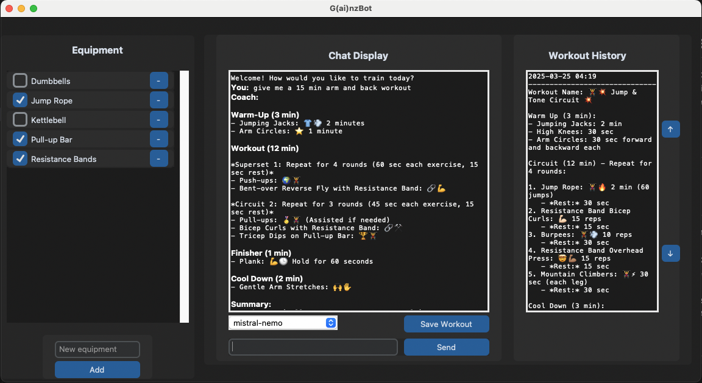

# G(AI)nzBot - AI-powered Workout Assistant

GainzBot is an AI-powered workout assistant designed to help users create personalized workout plans based on their preferences and available equipment. The app provides a chat interface where users can interact with the AI to generate workout routines, track their progress, and save workout histories.

## UI Preview



## Features

- **Custom Workout Generation**: Generate workout plans based on user preferences and available equipment.
- **Workout History**: View saved workout histories and scroll through past routines.
- **Equipment Management**: Manage workout equipment by adding or removing items from the list.
- **Chat Interface**: Interactive chat system for communication with the AI trainer.
- **Model Selection**: Select different AI models for workout generation.

## Requirements

- Python 3.x
- `customtkinter` for the UI
- `ollama` for AI chat interaction
- `emoji` for fun emoji integration in responses
- JSON and file handling for saving equipment and workout histories

## Installation

1. Clone the repository:
    ```bash
    git clone https://github.com/ifryed/G-ai-nzBot.git
    ```

2. Install the required dependencies:
    ```bash
    pip install -r requirements.txt
    ```

3. Set up your AI model (if not already done). GainzBot uses Ollama for generating workout routines. Ensure you have access to Ollama models.

4. Run the app:
    ```bash
    python app_ui.py
    ```

## Usage

- **Generate a Workout**: Type a workout request in the input field (e.g., "Generate a full-body workout").
- **View Workout History**: Navigate to the "Workout History" section to view your past workouts.
- **Save Workouts**: Save your workout after it's generated by clicking the "Save Workout" button.
- **Manage Equipment**: Add or remove equipment from the sidebar by typing the name of the equipment in the input field.


## Contributing

Feel free to fork the repository, submit issues, or create pull requests with improvements.

## License

This project is licensed under the MIT License - see the [LICENSE](LICENSE) file for details.

## Acknowledgements

- Special thanks to the `customtkinter` library for creating beautiful and customizable UIs.
- Thanks to the `ollama` API for enabling AI-powered interactions in the app.